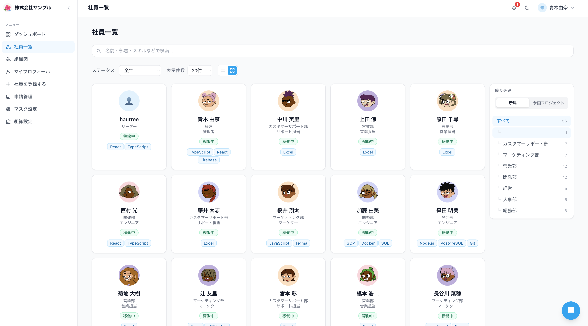

# LP制作ブリーフ: ひとナビ

## 目的

ひとナビのLPを別リポジトリで制作するために、訴求内容・掲載情報・構成案・未決事項をまとめる。

LPの主目的は、デモ誘導とポートフォリオ掲載。AIチャット、申請管理、組織管理を含むすべての主要機能を掲載対象とする。

LPのトーンは業務SaaS寄り。落ち着いた信頼感、管理画面としての使いやすさ、実務での検索・更新・承認のしやすさを前面に出す。

## サービス名

正式名称: ひとナビ

「人」+「ナビゲーション」の意味。組織内の人材、スキル、所属、稼働状況を見つけやすくし、最適なメンバー探しを支援する印象を出せる。

## サービス名候補メモ

### 推奨候補

- Talent Deck
  - 社員プロフィールやスキルを「カード/デッキ」のように見渡せる印象。英語名でポートフォリオにも載せやすい。
- People Atlas
  - 組織内の人材・スキル・所属を地図のように把握するニュアンス。AI検索や組織可視化と相性がよい。
- Skillfolio
  - Skill + Portfolio。社員ごとのスキルプロフィール管理が伝わりやすい。
- Team Profile
  - 直感的で説明不要。業務ツールらしく堅実。
- HitoBase
  - 「人」+ Database。日本語圏向けで覚えやすく、社員データベース感がある。

### SaaS寄り

- TalentHub
- PeopleBoard
- SkillHub
- Team Directory
- TalentGraph

### 日本語寄り

- ひとナビ
- スキル名鑑
- 社員プロフィールDB
- 人材見える化
- チーム人材帳

### ポートフォリオ寄り

- PeopleOps Studio
- Talent Intelligence
- Org Profile Manager
- AI Talent Finder
- Employee Insight

正式名称は「ひとナビ」に決定済み。上記候補は代替案メモとして残す。

## プロダクト概要

ひとナビは、社員プロフィール、部署、職種、スキル、稼働状況、プロジェクト情報を組織単位で一元管理するWebアプリ。社員自身は自分のプロフィールを更新でき、人事・管理者は組織内メンバーの登録、閲覧、編集、申請管理、組織設定を行える。

蓄積された社員データをもとに、AIチャットで人材検索・アサイン候補推薦ができる「人材データ活用」アプリとして訴求する。

## 想定ターゲット

- 小規模から中規模の組織で、社員情報・スキル情報をスプレッドシートで管理している人事/管理者
- プロジェクトごとのアサイン候補を、スキルや稼働状況から素早く探したいマネージャー
- 社員自身にプロフィール更新を任せ、情報の鮮度を保ちたいチーム
- 個人開発・社内ツール導入の文脈で、Firebaseベースの人材管理アプリを探している技術者

## コア価値

- 社員情報を一箇所に集約し、検索・閲覧・更新の手間を減らす
- スキル、部署、プロジェクト、稼働状況から人材を探しやすくする
- Googleログインと組織単位のデータ分離で、チームごとに安全に運用できる
- AIチャットにより「Reactが得意で今動ける人は？」のような自然言語で人材候補を探せる
- スキルやプロジェクトの追加申請ワークフローで、マスターデータの品質を保てる

## 主要機能

### 社員プロフィール管理

- 社員一覧、社員詳細、社員登録、社員編集
- 氏名、メール、部署、職種、雇用形態、ステータス、入社日、スキル、プロジェクト、プロフィール、自己紹介、強み、伸ばしたいスキル、興味、趣味、勤務地、稼働状況、経歴、資格、アバター画像を管理
- 退職者のデフォルト非表示、退職処理、完全削除
- CSVインポート用サンプルあり

### 検索・可視化

- 名前・部署・スキルなどのキーワード検索
- ステータスフィルタ
- 部署/プロジェクト別のツリー選択
- リスト表示とギャラリー表示の切り替え
- ページネーション

### ダッシュボード

- 在籍社員数、稼働中、休業中のサマリー
- ステータス内訳グラフ
- 部署別社員数グラフ
- スキル別人数TOP10グラフ

### 組織管理

- Googleログイン
- 新規組織作成
- 組織名とロゴ設定
- 組織ごとのデータ分離
- 管理者による社員の事前登録
- 事前登録済みメールでログインした社員の自動参加
- pending状態の「招待待ち」表示

### 権限管理

- 一般社員: 自分のプロフィール閲覧・編集
- 管理者: 全社員の登録・閲覧・編集・削除、組織設定、申請管理

### 申請ワークフロー

- 一般社員がスキル・プロジェクトの追加を申請
- 管理者が申請を承認/却下
- 未処理申請をヘッダー通知ベルで表示
- 承認後にマスターへ反映する設計

### AIチャット

- 全ページ共通のフローティングチャットUI
- 社員データに関する自然言語質問
- スキル検索、稼働状況確認、プロジェクトアサイン候補推薦
- 候補社員カードとプロフィールリンクを回答に表示
- Gemini APIを利用する設計

## 技術的な信頼材料

- React 19 + TypeScript + Vite
- Redux Toolkit
- Tailwind CSS v4
- Firebase Authentication
- Cloud Firestore
- Firebase Storage
- Cloud Run + Express.js API
- Recharts
- Vitest + fast-check
- Repository Pattern
- 組織IDベースのマルチテナント設計

## LPで前面に出すべき訴求

### メイン訴求

社員プロフィールとスキル情報を、探せる・更新できる・活用できるチーム資産にする。

### サブ訴求

- スプレッドシートに散らばった社員情報を、組織で使えるプロフィールデータベースへ
- スキル、部署、稼働状況から、必要な人材をすばやく見つける
- 社員自身が情報を更新し、管理者は承認と品質管理に集中できる
- AIに質問するだけで、アサイン候補やスキル保有者を探せる

## LP構成案

1. Hero
   - 見出し: ひとナビ
   - 補助見出し: 社員情報を、探せる人材データベースへ。
   - 補足: プロフィール、スキル、稼働状況、プロジェクト情報を一元管理。AIチャットでアサイン候補もすぐに見つかります。
   - CTA: デモを見る / GitHubを見る / お問い合わせ
   - ビジュアル: ダッシュボードまたは社員一覧のスクリーンショット

2. Problem
   - 社員情報がスプレッドシートや個人の記憶に散らばっている
   - 誰がどんなスキルを持っているか探しづらい
   - プロフィール更新が管理者任せになり、情報が古くなる
   - アサイン検討に時間がかかる

3. Solution
   - 社員プロフィールを一元管理
   - スキル・部署・プロジェクト・稼働状況で検索
   - 社員自身によるプロフィール更新
   - 申請ワークフローでマスターデータを整える
   - AIチャットで自然言語検索

4. Features
   - プロフィール管理
   - ダッシュボード/可視化
   - 組織管理/権限管理
   - 申請管理
   - AI人材検索

5. Use Cases
   - 「React経験者で今アサインできる人」を探す
   - 新入社員や異動者のプロフィールを確認する
   - 部署ごとの人数やスキル分布を把握する
   - メンバーが新しいスキルやプロジェクトを申請する

6. Security / Architecture
   - Googleログイン
   - 組織ごとのデータ分離
   - Firebase / Cloud Run構成
   - 管理者と一般社員の権限分離

7. CTA
   - デモを試す
   - GitHubで見る
   - 導入相談する

## コピー案

### H1候補

- ひとナビ
- 社員情報を、探せる人材データベースへ。
- スキルと稼働状況から、最適な人材をすぐに見つける。
- 社員プロフィールを、チームの意思決定に使える資産へ。

### CTA候補

- デモを見る
- GitHubで見る
- ポートフォリオで見る
- 技術構成を見る

LPの主CTAは「デモを見る」、副CTAは「GitHubで見る」または「技術構成を見る」がよい。

### 機能見出し候補

- 社員プロフィールを一元管理
- スキル・部署・プロジェクトで絞り込み
- 組織ごとに安全にデータを分離
- 申請フローでマスター情報をきれいに保つ
- AIに聞いて、人材候補を見つける

## 必要な素材

- アプリ名/サービス名: ひとナビ
- ロゴまたは仮ロゴ
- ブランドカラー
- ダッシュボード画面のスクリーンショット（ユーザー側で撮影・提供）
- 社員一覧画面のスクリーンショット（ユーザー側で撮影・提供）
- 社員詳細またはプロフィール編集画面のスクリーンショット（ユーザー側で撮影・提供）
- AIチャット画面のスクリーンショット（ユーザー側で撮影・提供）
- 申請管理画面のスクリーンショット（ユーザー側で撮影・提供）
- デモURL
- GitHubリポジトリURL
- 問い合わせ先またはCTAの遷移先
- 利用規約/プライバシーポリシーの有無

## 注意点

- 現状のREADMEには古い「フロントエンドのみ/モックデータ」記述が残っているが、コード上はFirebase Auth、Firestore、Cloud Run API、組織管理、申請、AIチャットが実装・設計されている。LPでは「現在使える機能」と「開発中/予定の機能」を分けて表記する必要がある。
- AIチャット、申請管理、組織管理はLP掲載対象。デモ環境で動かせる状態かどうかに応じて、「デモで体験可能」「機能紹介」の表現を分ける。
- LPの主目的はデモ誘導とポートフォリオ掲載。価格表や導入問い合わせを前面に出すより、機能デモ、技術構成、実装品質、利用シナリオを見せる構成が合う。
- スクリーンショット素材はユーザー側で撮影・提供する。LP制作側は、提供された画像をもとにヒーローや機能紹介セクションへ配置する。
- デザインは業務SaaS寄り。過度にポップな表現や装飾よりも、情報の見やすさ、信頼感、実務利用のイメージを優先する。

## 確認したい質問

1. デモURLとGitHubリポジトリURLは何を掲載しますか？
後ほど自身で入れます。
2. ロゴはテキストロゴで進めますか？それとも別途ロゴ画像を用意しますか？
後ほどロゴを入れます。
